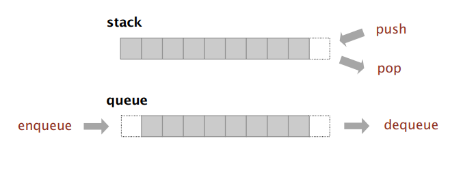

## Fundamental Data Types

- Value: collection of objects

- Operations: `insert`, `remove`, `iterate`, test if empty

- Intent is clear when we insert.



## Stack

### Linked-list implementation (space)

```java
public class LinkedStackOfStrings{
    private Node first = null;
    
    private class Node{
        String item;
        Node next;
    }
    
    public boolean isEmpty(){
        return first == null;
    }
    
    public void push(String item){
        Node oldFirst = first;
        first = new Node();
        first.item = item;
        first.next = oldFirst;
    }
    
    public String pop(){
        String item = first.item;
        first = first.next;
        return item;
    }     
}
```


### Array implementation (stack overflow)

```java
public class FixedCapacityOfStrings{
    private String[] s;
    private int N = 0;
    
    public FixedCapacityOfStrings(int capacity){
        s = new String[capacity];
    }
    
    public boolean isEmpty(){
        return N == 0;
    }
    
    public void push(String item){
        s[N++] = item;
    }
    
    public String pop(){
        /* avoid "loitering", garbage collector can reclaim memory only if no outstanding references */
        String item = s[--N];
        s[N] = null;
        return item;
    }
}
```

## Resizing Arrays

- If array is full, create a new array of **twice** the size, and copy items.

```java
public ResizingArrayStackOfStrings(){
    s = new String[1];
}

public void push(String item){
    if (N == s.length)
        resize(2 * s.length);
    s[N++] = item;
}

private void resizing(int capacity){
    String[] copy = new String[capacity];
    for (int i = 0; i < N; i++)
        copy[i] = s[i];
    s = copy;
}
```

Cost of inserting first N items:

N + (2 + 4 + 8 + ... + N) ~ 3N

- halve size of array s[] when array is 1/4 full (1/2 cause shrinking)

```java
public String pop(){
    String item = s[--N];
    s[N] = null;
    if(N > 0 && N = s.length/4)
    	resize(s.length/2);
    return item;
}
```

Invariant. Array is between 25% and 100% full.

## Tradeoff

- Linked-list Implementation
  - Every operation takes constant time in the **worst case**
  - Use extra time and space to deal with the links
- Resizing-array Implementation
  - Every operation takes constant **amortized** time
  - Less wasted space

## Memory Usage

- Linked-list Stack:
  - A stack with N items uses ~ 40N bytes. (reference slides page 11)
- Array-based Stack
  - ~ 8N (when full)    ~ 32N (when one-quarter full) (reference slides page 24)


