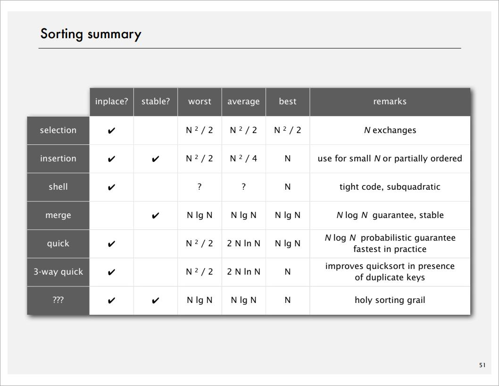

# Selection Sort

```java
public class Selection{
    public void sort(Comparable[] a){
        int N = a.length;
        for (int i = 0; i < N; i++) {
            int min = i;
            for (int j = i + 1; j < N; j++) {
                if (less(a[j], a[min])) {
                    min = j;
                }
            }
            exch(a, i, min);
        }
    }
    
    private boolean less(Comparable v, Comparable w){
        return v.compareTo(w) < 0;
    }
    
    private void exch(Comparable[] a, int i, int j){
        Comparable swap = a[i];
        a[i] = a[j];
        a[j] = swap;
    }
}
```

# Insertion sort

```java
public class Insertion{
    public void sort(COmparable[] a){
        int N = a.length;
        for (int i = 0; i < N; i++) {
            for (int j = 0; j > 0; j--) {
                if (less(a[j], a[j-1])) {
                    exch(a, j, j-1);
                } else {
                    break;
                }
            }
        }
    }
    
    private boolean less(Comparable v, Comparable w){
        return v.compareTo(w) < 0;
    }
    
    private void exch(Comparable[] a, int i, int j){
        Comparable swap = a[i];
        a[i] = a[j];
        a[j] = swap;
    }
}
```

# Shellsort

```java
public class Shell{
    public void sort(Comparable[] a){
        int N = a.length;
        
        /* generate `3x+1` increment sequence */
        int h = 1;
        while (h < N/3) {
            h = 3*h + 1;
        }
        
        while (h >= 1) {
            /* Insertion sort */
            for (int i = h; i < N; i++) {
                for (int j = i; j >= h && less(a[j], a[j-h]); j-=h) {
                    exch(a, j, j-h);
                }
            }
            /* Move to the next increment */
            h = h/3
        }
    }
    
    private boolean less(Comparable v, Comparable w){
        return v.compareTo(w) < 0;
    }
    
    private void exch(Comparable[] a, int i, int j){
        Comparable swap = a[i];
        a[i] = a[j];
        a[j] = swap;
    }
}
```

> The worst-case number of compares used by `shellsort` with the 3x+1 increments is O($N^{3/2}$).

# Merge Sort

## Mergesort

Basic plan

- Divide array into two halves
- **Recursively** sort each half
- Merge two halves

```java
public class Merge{
    private void merge(Comparable[] a, Comparable[] aux, int lo, int mid, int hi){
        assert isSorted(a, lo, mid);     // precondition: a[lo..mid] sorted
        assert isSorted(a, mid+1, hi);   // precondition: a[mid+1..hi] sorted

        for (int k = lo; k <= hi; k++) { //copy
            aux[k] = a[k];
        }

        int i = lo;
        int j = mid + 1;
        for (int k = lo; k <= hi; k++) { //merge
            if (i > mid)                   a[k] = aux[j++];
            else if (j > hi)               a[k] = aux[i++];
            else if (less(aux[j], aux[i])) a[k] = aux[j++];
            else                           a[k] = aux[i++];
        }

        assert isSorted(a, lo, hi);      // postcondition: a[lo..hi] sorted
    }
    
    private void sort(Comparable[] a, Comparable[] aux, int lo, int hi){
        if (hi <= lo) return;
        int mid = lo + (hi - lo) / 2;
        sort(a, aux, lo, mid);
        sort(a, aux, mid+1, hi);
        merge(a, aux, lo, mid, hi);
    }
    
    public void sort(Comparable[] a){
        aux = new Comparable[a.length]; // creat axu array here!!!
        sort(a, aux, 0, a.length-1);
    }
}
```

### Assertions

- Assertion: statement to test assumptions about your program.
  - Helps detect logic bugs
  - Documents code

- Java assert statement: Throws Exception unless Boolean condition is true.

- Can enable or disable at runtime => No cost in production code.

  ```java
  java -ea MyProgram // enable assertions
  java -da MyProgram // disable assertions (default)
  ```

- Best Practices: 
  - Use assertions to check internal invariants
  - assume assertions will be disabled in production code
  - DO NOT use for external argument checking

### Improvement

- Use insertion sort for small subarrays

  - Mergesort has too much overhead for tiny subarrays.
  - Cutoff to insertion sort for ~7 items

  ```java
  private void sort(Comparable[] a, Comparable[] aux, int lo, int hi){
      if (hi <= lo + CUTOFF - 1) {
      	Insertion.sort(a, lo, hi);
          return;
      }
      
      int mid = lo + (hi - lo) / 2;
      sort(a, aux, lo, mid);
      sort(a, aux, mid+1, hi);
      merge(a, aux, lo, mid, hi);
  }
  ```

- Stop if already sorted

  - Is biggest item in first half <= smallest item in second half?
  - Helps for partially-ordered arrays.

  ```java
  private void sort(Comparable[] a, Comparable[] aux, int lo, int hi){
      if (hi <= lo) return;
      int mid = lo + (hi - lo) / 2;
      sort(a, aux, lo, mid);
      sort(a, aux, mid+1, hi);
      
      if (!less(a[mid+1], a[mid])) return;
      
      merge(a, aux, lo, mid, hi);
  }
  ```

- Eliminate the copy to the auxiliary array: Save time (but not space) by switching the role of the input and auxiliary array in each recursive call.

```java
private void merge(Comparable[] a, Comparable[] aux, int lo, int mid, int hi){

    int i = lo;
    int j = mid + 1;
    for (int k = lo; k <= hi; k++) { //merge from a[] to axu[]
    if (i > mid)                   aux[k] = a[j++];
    else if (j > hi)               aux[k] = a[i++];
    else if (less(aux[j], aux[i])) aux[k] = a[j++];
    else                           aux[k] = a[i++];
    }
}

private void sort(Comparable[] a, Comparable[] aux, int lo, int hi){
    if (hi <= lo) return;
    int mid = lo + (hi - lo) / 2;
    sort(aux, a, lo, mid);
    sort(aux, a, mid+1, hi);
    merge(a, aux, lo, mid, hi);
}
```
## Bottom-up Mergesort

Basic plan:

- Pass through array, merging subarrays of size 1
- Repeat for subarrays of size 2, 4, 8, 16

```java
public class MergeBU{
    private Comparable[] aux;
    
    private void merge(Comparable[] a, int lo, int mid, int hi){
        /* as before */
    }
    
    public void sort(Comparable[] a){
        int N = a.length;
        aux = new Comparable[N];
        for (int sz = 1; sz < N; sz = sz + sz)
            for (int lo = 0; lo < N - sz; lo += sz+sz)
                merge(a, lo, lo+sz-1, Math.min(lo+sz+sz+1, N-1));
    }
}
```

# Quicksort

> Caveat emptor: Many textbook implementations go **quadratic** if array
>
> - is sorted or reverse sorted
> - Has many duplicates (even if randomized!)


Basic plan:

- **shuffle** the array
- **Partition** so that, for some j
  - entry of `a[j]` is in place
  - no larger entry to the left of `j`
  - no smaller entry to the right of `j`
- **Sort** each piece recursively

Quick Partition:

Phase I. Repeat until `i` and `j` pointers cross

- Scan `i` from left to right so long as (`a[i]` < `a[lo]`)
- Scan `j` from left to right so long as (`a[j]` > `a[lo]`)
- Exchange `a[i]` with `a[j]`

Phase II. When pointers cross

- Exchange `a[lo]` with `a[j]`

```java
class Quicksort{
    private int partition(Comparable[] a, int lo, int hi){
        int i = lo, j = hi+1;
        while (true) {
            while (less(a[++i], a[lo]))
                if (i = hi) break;
            while (less(a[lo], a[--j]))
                if (j == lo) break;
            if (i >= j) break;
            exch(a, i, j);
        }
        exch(a, lo, j);
        return j;	// return index of item now known to be in place
    }
    
    public void sort(Comparable[] a) {
        StdRandom.shuffle(a);
        sort(a, 0, a.length-1);
    }
    
    private void sort(Comparable[] a, int lo, int hi) {
        if (hi <= lo) return;
        int j = paration(a, lo, hi);
        sort(a, lo, j-1);
        sort(a, j+1, hi);
    }
}
```

## Practical improvements

Insertion sort small subarrays

- Even quicksort has too many overhead for tiny subarrays
- Cutoff to insertion sort for ≈ 10 items
- Note: could delay insertion sort until one pass at end

```java
private void sort(Comparable[] a, int lo, int hi) {
    if (hi <= lo + CUTOFF - 1) {
    	Insertion.sort(a, lo, hi);
       	return;
    }
    int j = paration(a, lo, hi);
    sort(a, lo, j-1);
    sort(a, j+1, hi);
}
```

Median of sample

- Best choice of pivot item = median
- Estimate true median by taking median of sample
- Median-of-3 (random) item
  - ≈ $\frac{12}{7}NlnN$ compares (slightly fewer)
  -  ≈ $\frac{12}{35}NlnN$ exchanges (slightly more)

```java
private void sort(Comparable[] a, int lo, int hi) {
    if (hi <= lo) return;
    
    int m = medianOf3(a, lo, lo+(hi-lo)/2, hi); // improve about 10%
    swap(a, lo, m);
    
    int j = paration(a, lo, hi);
    sort(a, lo, j-1);
    sort(a, j+1, hi);
}
```

## Selection

> Goal: Given an array of N items, find a $k^{th}$ smallest item.
>
> Ex. Min (k = 0), max (k = N - 1), median (k = N/2).

Applications:

- Order statistics
- Find the "top k"

Use theory as a guide:

- Easy $NlogN$ upper bound. How?
- Easy N upper bound for k = 1, 2, 3. How?
- Easy N lower bound. Why?

### Quick-select

Partition array so that:

- Entry `a[j]` is in place
- No larger entry to the left of `j`
- No smaller entry to the right of `j`

Repeat in **one** subarray, depending on `j`; finished when `j` equals `k`

```java
public Comparable select(Comparable[] a, int k){
    StdRandom.shuffle(a);
    int lo = 0, hi = a.length-1;
    while (hi > lo) {
        int j = partition(a, lo, hi);
        if (j < k) lo = j+1;
        else if (j > k) hi = j-1;
        else return a[k];
    }
    return a[k];
}
```

## Duplicate keys

> Quadratic when all keys are equal

3-way partitioning:

- Entries between `lt` and `gt` equal to partition item `v`
- No larger entries to left of `lt`
- No smaller entries to right of `gt`


pseudocode:

- let `v` be partitioning item a[lo]

- Scan `i` from left to right

  - (`a[i]` < `v`): exchange `a[lt]` with `a[i]`; increment both `lt` and `i`

  - (`a[i]` > `v`): exchange `a[gt]` with `a[i]`; decrement `gt`

  - (`a[i]` = `v`): increment `i`

### 3-way quicksort

```java
private void sort(Comparable[] a, int lo, int hi){
    if (hi <= lo) return;
    int lt = lo, gt = hi;
    Comparable v = a[lo];
    int i = lo;
    while (i < gt){
        int cmp = a[i].compareTo(v);
        if (cmp < 0) exch(a, lt++, i++);
        else if (cmp > 0) exch(a, i, gt--);
        else i++;
    }
    sort(a, lo, lt-1);
    sort(a, gt+1, hi);
}
```

## Java system sorts

`Arrays.sort()`:

- Has different method for each primitive type
- Has a method for data types that implement Comparable
- Has a method that uses a Comparator
- Uses tuned quicksort for primitive types; tuned mergesort for objects.

>Why use different algorithms for primitive and reference types?
>
>- If a programmer use Objects, maybe **spaces** not a critically important consideration, so the extra space used by **mergesort** maybe is not a problem.
>- If the program is using primitive types, maybe performance is the important thing, so we'll use the **quicksort**.
>
>Why does `Arrays.sort()` in Java use mergesort instead of quicksort when sorting reference types?
>
>- stability
>- $nlogn$ guaranteed performance

### Engineering a system sort

Basic algorithm = quicksort

- Cutoff to insertion sort for small subarrays
- Partitioning scheme: 3-way partitioning. [like Dijkstra]
- Partitioning item:
  - small arrays: middle entry
  - medium arrays: median of 3
  - large arrays: Tukey's ninther

>Tukey's ninther: Median of the median of 3 samples, each of 3 entries.
>
>- Approximates the median of 9
>- Uses at most 12 compares
>
>Q. Why use Tukey's ninther?
>
>A. Better partitioning than random shuffle and less costly.

## System sorts

Internal sorts:

- Insertion sort, selection sort, bubblesort, shaker sort
- Quicksort, mergesort, heapsort, samplesort, shellsort
- Solitaire sort, red-black sort, splaysort, Yaroslavskiy sort, psort, ...

External sorts:

- Poly-phase mergesort, cascade-merge, oscillation sort.

String/radix sorts:

- Distribution, MSD, LSD, 3-way string quicksort

Parallel sorts:

- Bitonic sort, Batcher even-odd sort
- Smooth sort, cube sort, column sort
- GPUsort

# Complexity of sorting

- **Computational complexity**: Framework to study efficiency of algorithms for solving a particular problem X.
- **Model of computation**: Allowable operations.
- **Cost model**: Operation counts.
- **Upper bound**: Cost guarantee provided by **some** algorithm for X.
- **Lower bound**: Proven limit on cost guarantee of **all** algorithm for X.
- **Optimal algorithm**: Algorithm with best possible cost guarantee for X.


## sorting

- **Model of computation**: Decision tree$^1$.
- **Cost model**: # compares.
- **Upper bound**: ~$Nlg N$ from mergesort.
- **Lower bound** $^2$: $lg(N!)$ ~ $NlgN$      
- **Optimal algorithm**: ?.

> 1. Decision tree: can access information only through compares. (e.g. Java Comparable framework)
> 2. Proof: [slides page 32]
>    - Assume array consists of N distinct values $a_1$ through $a_N$
>    - Worst case dictated by **height** h of decision tree.
>    - Binary tree of height h has at most $2^h$ leaves
>    - $N!$ different orderings => at least $N!$ leaves


# Comparators

## Comparator Interface

1. **Comparator interface**: sort use an **alternate order**

   > Required property: Must be a **total order**
   > ```java
   > public interface Comparator<Key>{
   >     int compare(Key v, Key w){
   >     }
   > }
   > ```

2. **system sort**

   - To use with Java system sort:

     - Create Comparator object
     - Pass as second argument to Arrays.sort()

# Stability

> A stable sort preserves the relative order of items with equal keys

Stable sort:

- Insertion sort
- Mergesort

(Not selection sort or shellsort)

# Sorting summary



