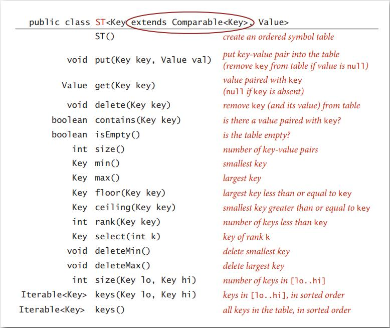

# Symbol Tables

## API

### Symbol tables

Key-value pair abstraction:

- **Insert** a value with specific key
- Given a key, **search** for the corresponding value

### Equals design

"Standard" recipe for user-defined types:

- Optimization for reference equality
- Check against `null`
- Check that two objects are of the same type and case
- Compare each significant field:
  - If field is a primitive type, use `==`
  - if field is an object, use `equals()`
  - if field is an array, apply to each entry
    - `Arrays.equals(a, b)`
    - `Arrays.deepEquals(a, b)`

Best practice:

- No need to use calculated fields that depending on other fields
- Compare fields mostly likely to differ first
- Make `compareTo()` consistent with `equals()`

Applications:

- Frequency counter implementation (slides page 14)

## Elementary implementations

### Sequential search in a linked list

- Data structure: Maintain an (unordered) linked list of key-value pairs
- Search: Scan through all keys until find a match
- Insert: Search; if not match add to front

### Binary search in an order array

- Data structure: Maintain an ordered array of key-value pairs
- Rank helper function: 

## Ordered operations

