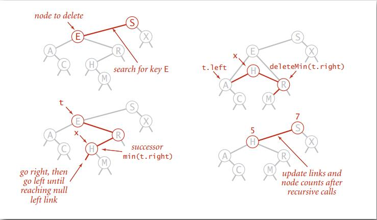

# Binary Search Tree

## BST

> Definition: A BST is a **binary tree** in **symmetric order**

A binary tree is either:

- Empty
- Two disjoint binary trees(left and right)

Symmetric order: Each node has a key, and every node's key is:

- Larger than all keys in its left subtree
- Smaller than all keys in its right subtree

### BST representations in Java

> Java definition: A BST is a reference to a root node

A node is comprised of four fields:

- A **`Key`** and a **`Value`**.
- A reference to the **left** and **right** subtree.

## Ordered operations

- Minimum: Smallest key in table --> Left most node

- Maximum: Largest key in table --> right most node

- Floor: Largest key <= to a given key

  - Case 1: k equals the key at root

    The floor of k is k

  - Case 2: k is less than the key at root

    The floor of k is in the left subtree

  - Case 3: k is great than the key at root

    The floor of k is in the right subtree (if there is any key <= k in right subtree);

    otherwise it is the key in the root

  ```java
  public Key floor(Key key) {
    Node x = floor(root, key);
    if (x == null) return null;
    return x.key;
  }
  private Node floor(Node x, Key key) {
    if (x == null) return null;
    int cmp = key.compareTo(x.key);
    
    if (cmp == 0) return x;
    
    if (cmp < 0) return floor(x.left, key);
    
    Node t = floor(x.right, key);
    if (t != null) return t;
    else return x;
  }
  ```

- Ceiling: Smallest key >= to a given key

- subtree counts

  ```java
  public int size() { return size(root); }
  private int size (Node x) {
    if (x = null) return 0;
    return x.count;
  }
  private Node put(Node x, Key key, Value val){
    if (x == null) return new Node(key, val, 1);
    int cmp = key.compareTo(x.key);
    if (cmp < 0) x.left = put(x.left, key, val);
    else if (cmp > 0) x.right = put(x.right, key, val);
    else x.val = val;
    x.count = 1 + size(x.left) + size(right);
    return x;
  }
  ```

## Deletion

To delete a node with key k: search for node t containing key k.

- Case 1: [0/1 child] 

  - Delete t by replacing parent link.

- Case 2: [2 children] 

  - Find successor x of t (x have no left child)
  - Delete the minimum in t's right subtree
  - Put x in t's spot

  

  ```java
  public void delete(Key key) {
    root = delete(root, key);
  }
  
  private Node delete(Node x, Key key) {
    if (x == null) return null;
    int cmp = key.compareTo(x.key);
    if (cmp < 0) x.left = delete(x.left, key);
    else if (cmp > 0) x.right = delete(x.right, key);
    else {
      if (x.right == null) return x.left;
      if (x.left == null) return x.right;
      Node t = x;
      x = min(t.right);
      x.right = deleteMin(t.right);
      x.left = t.left;
    }
    x.count = size(x.left) + size(x.right) + 1;
    return x;
  }
  ```

  