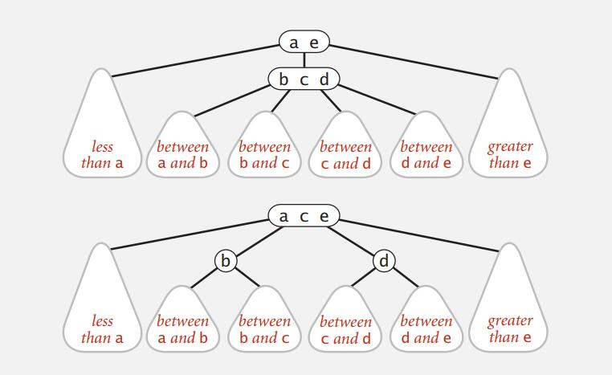

# Balanced Search Tree

## 2-3 Tree

Allow 1 or 2 keys per node.

- 2-node: one key, two children (smaller, larger)
- 3-node: two keys, three children (smaller, between, larger)

Perfect balance: 

​	Every path from root to null link has same length

Symmetric order:

​	Inorder traversal yields keys in ascending order

**Search**:

- Compare search key against keys in node
- Find interval containing search key
- Follow associated link (recursively)

**Insert** 

- into a 2-node at bottom (leaf node):

  - search for key, as usual
  - Replace 2-node with 3-node

- Insert into a 3-node at bottom:

  - Add new key to 3-node to create temporary 4-node
  - Move middle key in 4-node into parent

  >​         R                                           R X
  >
  >    ​      /     \                    --->>>        /   |   \
  >
  >​    P     SXZ                --->>>      P    S     Z       ​                     

  - Repeat up the tree, as necessary
  - If you reach the root and it's a 4-node, split it into three 2-nodes

  >                         ​                                                         L
  > 
  >          ​                                                       /   \ 
  >          ​            E R             --->>>           E        R
  >
  >          ​        /    |    \          --->>>        /   \     /   \
  >
  >          ​    AC   HLP  SX                    A C   H  P    S X

Properties:

- **Invariants**: Maintains symmetric order and perfect balance. [Slide page 11]
  - Proof: Each transformation maintains symmetric order and perfect balance.

- **Perfect balance**: Every path from root to null link has same length.