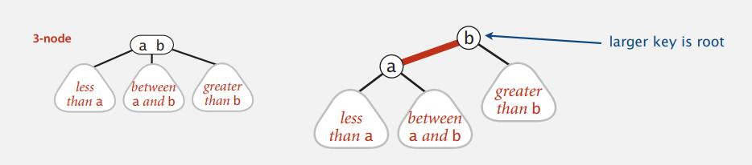
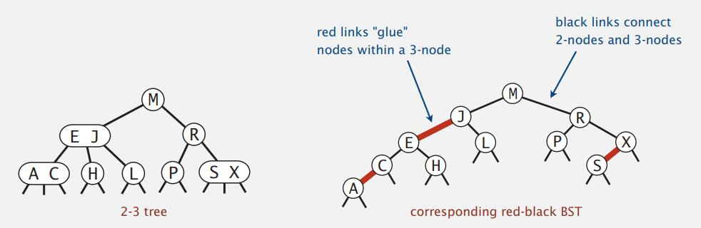
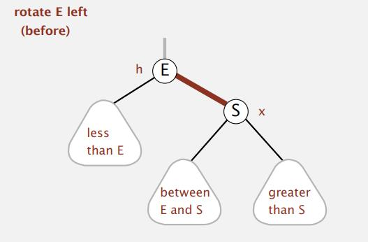
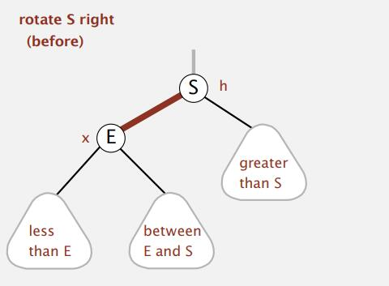
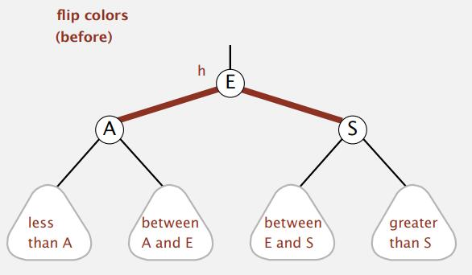

# Balanced Search Tree

## 2-3 Tree

Allow 1 or 2 keys per node.

- 2-node: one key, two children (smaller, larger)
- 3-node: two keys, three children (smaller, between, larger)

Perfect balance: 

​	Every path from root to null link has same length

Symmetric order:

​	Inorder traversal yields keys in ascending order

**Search**:

- Compare search key against keys in node
- Find interval containing search key
- Follow associated link (recursively)

**Insert** 

- into a 2-node at bottom (leaf node):

  - search for key, as usual
  - Replace 2-node with 3-node

- Insert into a 3-node at bottom:

  - Add new key to 3-node to create temporary 4-node
  - Move middle key in 4-node into parent

  >​         R                                           R X
  >
  >    ​      /     \                    --->>>        /   |   \
  >
  >​    P     SXZ                --->>>      P    S     Z       ​                     

  - Repeat up the tree, as necessary
  - If you reach the root and it's a 4-node, split it into three 2-nodes

  >                         ​                                                         L
  > 
  >          ​                                                       /   \ 
  >          ​            E R             --->>>           E        R
  >
  >          ​        /    |    \          --->>>        /   \     /   \
  >
  >          ​    AC   HLP  SX                    A C   H  P    S X


Properties:

- **Invariants**: Maintains symmetric order and perfect balance. [Slide page 11]
  - Proof: Each transformation maintains symmetric order and perfect balance.

- **Perfect balance**: Every path from root to null link has same length.

***

## Red-Black BSTs

### Left-leaning red-black BSTs

- Represent 2-3 tree as a BST
- Use "internal" left-leaning links as "glue" for 3-nodes





A BST such that:

- No node has two red links connected to it.
- Every path from root to null link has the same number of black links.
- Red links lean left. 

> Observation: Search is the same as for elementary BST (ignore color)

```java
public Val get(Key key) {
  Node x = root;
  while (x != null) {
    int cmp = key.compareTo(x.key);
    if (cmp < 0) x = x.left;
    if (cmp > 0) x = x.right;
    else return x.val;
  }
  return null;
}
```

### Red-black BST representation

> Each node is pointed to by precisely one link (from its parent) => can encode color of links in color.

```java
private static final boolean RED = true;
private static final boolean BLACK = false;

private class Node{
  Key key;
  Value val;
  Node left, right;
  boolean color;    // color of parent link
}

private boolean isRed(Node x){
  if (x == null) return false;
  return x.color == RED;
}
```

### Elementary red-black BST operations

1. **Left rotation**: Orient a (temporarily) right-leaning red link to lean left.



> Invariants: Maintains symmetric order and perfect black balance.

```java
private Node rotateLeft(Node h){
  assert isRed(h.right);
  Node x = h.right;
  h.right = x.left;
  x.left = h;
  x.color = h.color;
  h.color = RED;
  return x;
}
```

2. **Right rotation**: Orient a left-leaning red link to (temporarily) lean right.



> Invariants: Maintains symmetric order and perfect black balance.

```java
private Node rotateRight(Node h){
  assert isRed(h.left);
  Node x = h.left;
  h.left = x.right;
  x.right = h;
  x.color = h.color;
  h.color = RED;
  return x;
}
```

3. **Color flip**: Recolor to split a (temporary) 4-node.



> Invariants: Maintains symmetric order and perfect black balance.

```java
private void flopColors(Node h){
  assert !isRed(h);
  assert isRed(h.left);
  assert isRed(h.right);
  
  h.color = RED;
  h.left.color = BLACK;
  h.right.color = BLACK;
}
```

4. Insertion in a LLRB Tree

   Case 1: Insert into a 2-node at the bottom.

   - Do standard BST insert; color new link red.
   - If new red link is a right link, rotate left.

   Case 2: Insert into a  3-node at the bottom. 

   - Do standard BST insert; color new link red.
   - Rotate t balance the 4-node (If needed).
   - Flip colors to pass red link up one level.
   - Rotate to make  lean left (If needed).
   - Repeat case 1 or 2 up the tree (If needed)

### Insertion in a LLRB tree: Java Implementation

Same code handles all cases:

- Right child red, left child black: **rotate left**
- Left child, left-left grandchild red: **rotate right**
- Both children red: **flip colors**

```java
private Node put(Node h, Key key, Value val){
  if (h == null) return new Node(key, value, RED);
  int cmp = key.compareTo(h.key);
  if (cmp < 0) h.left = put(h.left, key, val);
  if (cmp > 0) h.right = put(h.right, key, val);
  if (cmp == 0) h.val = val;
  
  if (isRed(h.right) && isRed(h.left)) h = rotateLeft(h);
  if (isRed(h.left) && isRed(h.left.left)) h = rotateRight(h);
  if (isRed(h.left) && isRed(h.right)) flipColors(h);
  
  return h;
}
```

## B-Trees

B-tree: Generalize 2-3 trees by allowing up to M-1 key-link pairs per node

- At least 2 key-link pairs at root.
- At least $M/2$ key-link pairs in other nodes.
- External nodes contain client keys.
- Internal nodes contain copies of keys to guide search.

